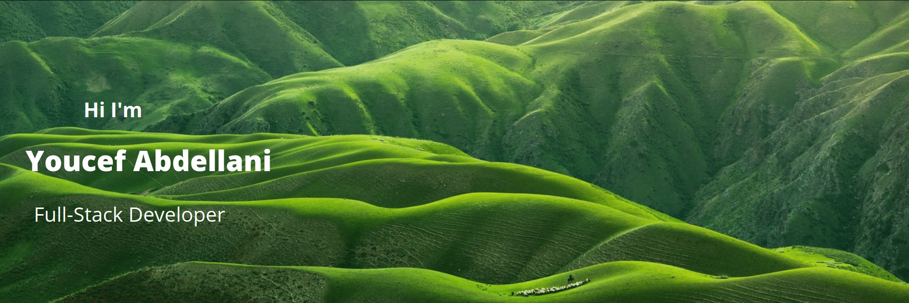

### Hi, I'm Youcef Abdellani 👋

I'm a full-stack web developer, I'm interested in Javascript, Python, Django, React, and Next.js. I like also to learn new technologies and have experiences with different projects. i have eager to Learning new web technologies.
I work in a service providing booking system.
I currently use:
- Django
- Django Rest framework (DRF)
- Pytest for testing
- Django-channel for real time notifications
- drf-spectacular for swagge documentations
- GitHub for versoin management
- Ruff for linter

